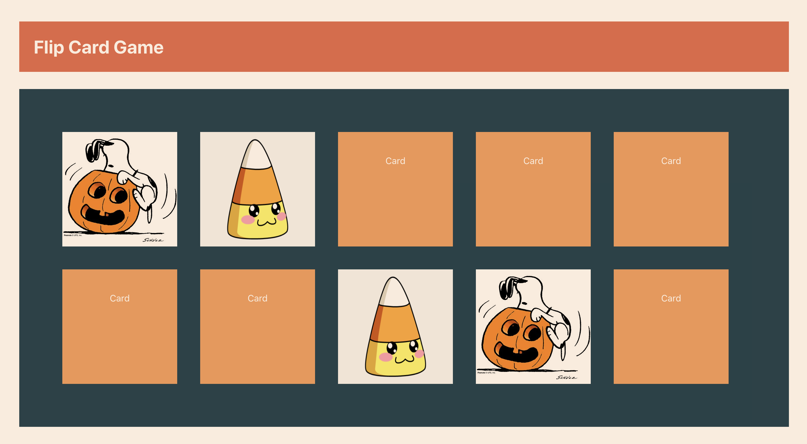

# Create a Card Flip Game

This is an exercise for CoLab Intro to React Class. In this exercise, we're going to follow the instructions in App.js to create a simple Halloween themed card flip game. Let's get started!

Link to slides: https://docs.google.com/presentation/d/1Bpoq3PI1CtbSG6Wgx1iMWOKc6f--3yBMqz3TP28rAR4/edit?usp=sharing

### `npm start`

Runs the app in the development mode.\
Open [http://localhost:3000](http://localhost:3000) to view it in the browser.